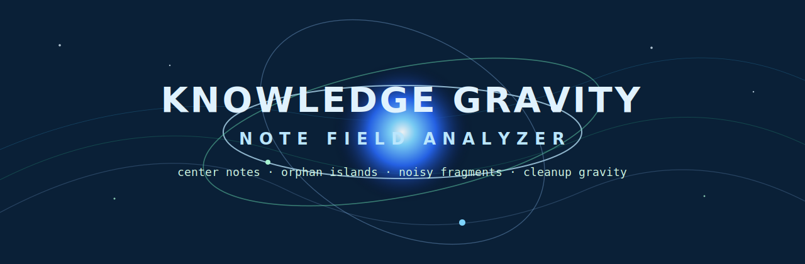
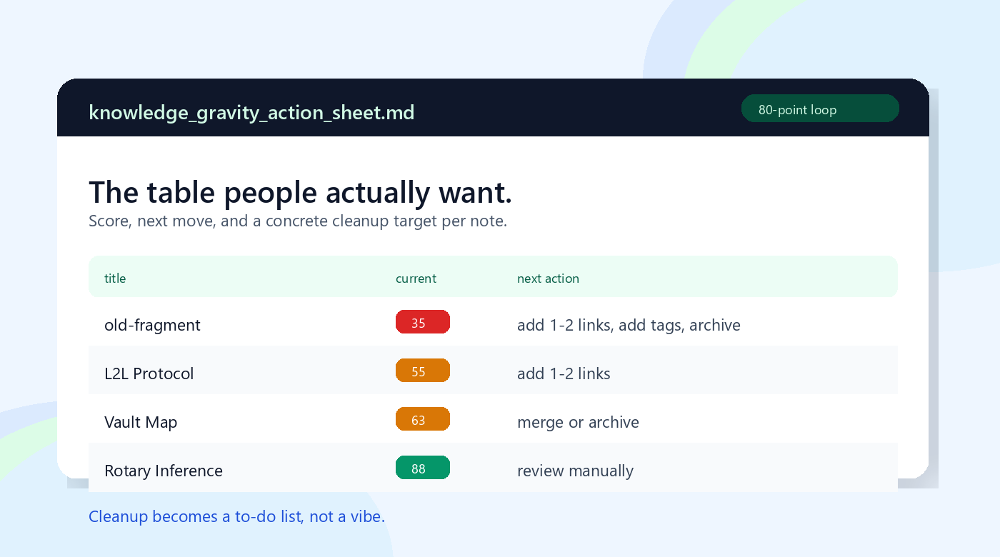
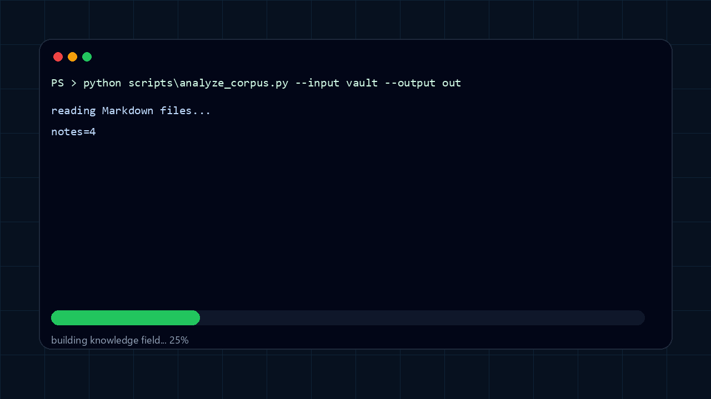

<p align="center">
  
</p>

<p align="center">
  
</p>

<p align="center">
  
</p>

<h1 align="center">Knowledge Gravity Lab</h1>

<p align="center">
  <strong>노트 속에 숨어 있는 지식의 중력장을 그립니다.</strong><br/>
  Obsidian vault를 넣으면 무엇이 중심이고, 무엇이 노이즈이며, 무엇부터 정리할지 알려줍니다.
</p>

<p align="center">
  
  
  
  
  
</p>

<p align="center">
  <a href="README.md">English</a> | 한국어
</p>

---

Knowledge Gravity Lab은 진지하게 노트를 쌓는 사람이 결국 마주치는 문제를 위한 작은 오프라인 도구입니다. 노트는 많아졌는데 무엇이 핵심이고, 무엇이 방치됐고, 어디부터 정리해야 할지 모를 때 사용합니다.

Markdown 또는 Obsidian 폴더를 넣으면 다음을 알려줍니다.

- 중심 주제
- 고립된 노트
- 노이즈로 보이는 파일
- 너무 커진 클러스터
- 노트별 다음 정리 행동

Python 파일 하나로 실행됩니다. API도 없고, 런타임 LLM 호출도 없으며, 같은 vault에는 같은 결과가 나오는 deterministic 방식입니다.

이 도구는 특정 AI에 묶여 있지 않습니다. 커맨드라인에서 바로 실행할 수 있고, Codex, Claude, 또는 로컬 마크다운 지침과 Python 스크립트를 읽고 실행할 수 있는 어떤 assistant workflow에서도 사용할 수 있습니다.

## 대상

- Obsidian vault
- 연구 노트
- 발명/아이디어 로그
- 논문 카드
- 메모리 export
- 소설/세계관 설정집
- 구조를 잡고 싶은 모든 Markdown/text 폴더

## 생성되는 결과물

| Output | 설명 |
|---|---|
| `knowledge_gravity_report.md` | 중심 노트, 클러스터, 노이즈, 고립 노트 요약 리포트 |
| `knowledge_gravity_action_sheet.md` | 바로 정리할 수 있는 임시 작업 시트 |
| `knowledge_gravity_nodes.csv` | 노트별 점수와 지표 |
| `knowledge_gravity_edges.csv` | 추론된 노트 간 연결 |
| `knowledge_gravity_data.json` | 기계가 읽을 수 있는 전체 분석 payload |

## 왜 다른가

대부분의 노트 도구는 그래프를 보여줍니다. Knowledge Gravity Lab은 조금 다른 질문을 합니다.

> 어떤 노트가 전체 지식장을 끌어당기고 있고, 어떤 노트가 혼자 떠다니는가?

링크, 태그, 제목 구조, 노트 크기, 저장소 내 비중, 중심성, 고립 여부, 리뷰 위험도를 함께 보고 “그래서 무엇을 먼저 정리해야 하는가”에 답합니다. 목적은 예쁜 그래프가 아니라 다음 행동을 분명하게 만드는 것입니다.

## 설치

저장소를 clone합니다.

```powershell
git clone https://github.com/JorrrrrdDin/knowledge-gravity-lab.git
cd knowledge-gravity-lab
```

바로 실행할 수 있습니다.

```powershell
python scripts\analyze_corpus.py --input "C:\path\to\vault" --output "D:\knowledge-gravity-output"
```

선택적으로 assistant workflow 폴더에 설치할 수 있습니다. 같은 핵심 파일을 Codex, Claude, 또는 호환되는 로컬 agent workflow에서 사용할 수 있습니다.

```powershell
Copy-Item -Recurse . "<assistant-workflows>\knowledge-gravity-lab" -Force
```

설치된 폴더 구조는 다음과 같습니다.

```text
knowledge-gravity-lab/
  SKILL.md
  agents/openai.yaml
  scripts/analyze_corpus.py
  references/public-boundary.md
  references/existing-rights-check.md
```

## 사용

커맨드라인에서 직접 실행합니다.

```powershell
python scripts\analyze_corpus.py --input "C:\path\to\vault" --output "D:\knowledge-gravity-output"
```

분석에서 제외할 폴더가 있으면 `--skip-dir`를 사용합니다.

```powershell
python scripts\analyze_corpus.py --input "C:\path\to\vault" --output "D:\knowledge-gravity-output" --skip-dir "archive" --skip-dir "templates"
```

assistant workflow에 설치했다면 이렇게 요청할 수 있습니다.

```text
Use Knowledge Gravity Lab on my Obsidian vault and tell me what to clean first.
```

또는 Claude/Codex에서 다음처럼 말해도 됩니다.

```text
이 폴더에 Knowledge Gravity Lab을 적용해서 중심 노트, 고립 노트, 노이즈, 먼저 정리할 항목을 알려줘.
```

## 피드백 루프

action sheet는 점수를 보여주는 데서 끝나지 않고 정리 행동을 유도합니다.

```text
이 노트는 61/100입니다.
링크 2개를 추가하고, 비대한 섹션을 분리하고, 가장 가까운 클러스터와 연결하면 80점에 가까워집니다.
```

흐름은 단순합니다.

1. 지식장을 분석합니다.
2. action sheet를 엽니다.
3. 가장 효과가 큰 노트부터 정리합니다.
4. 다시 실행합니다.
5. 지식 베이스가 점점 선명해지는지 확인합니다.

## 공개 사용 경계

이 프로젝트는 실용적인 지식 위생 도구입니다. 법률 조언도 아니고, 특허 출원 패키지도 아니며, 어떤 노트가 참/거짓임을 보증하지 않습니다.

Knowledge Gravity Lab의 출력은 판단 보조 자료입니다. 최종 판단은 사람이 해야 합니다.

## 저장소 구조

```text
.
|-- SKILL.md
|-- agents/
|   `-- openai.yaml
|-- scripts/
|   `-- analyze_corpus.py
|-- references/
|   |-- public-boundary.md
|   `-- existing-rights-check.md
|-- tests/
|   `-- test_analyze_corpus.py
`-- assets/
    `-- knowledge-gravity-banner.svg
```

## 개발 검증

```powershell
python -m pytest -q
python -m compileall -q scripts tests
```

## License

MIT License.
